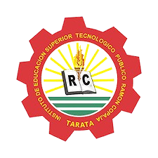

<<<<<<< HEAD
# SCRUM_ASPTI-
METODOLOGIA SRUM
# INTEGRANTES  
FIORELA MILADY TICAHUANCA CUTIPA
=======
##### "AÑO DE LA RECUPERACIÓN Y CONSOLIDACIÓN DE LA ECONOMÍA PERUANA"
 

# INSTITUTO DE EDUCACIÓN SUPERIOR TECNOLÓGICO RAMÓN COPAJA

## PROGRAMA DE ESTUDIOS

### **ARQUITECTURA DE PLATAFORMAS Y SERVICIOS DE TECNOLOGÍAS DE LA INFORMACIÓN – APSTI**

# TRABAJO ENCARGADO N°03

## *"METODOLOGIA SCRUM"*

# Que se presenta para el curso:  
**“APLICACIONES WEB”**  

---

### Docente:  
FIORELA MILADY TICAHUANCA CUTIPA  

### Estudiante:  
ADVIT MANDAMIENTO CUNURANA
HILDEBRANDO JAVIER CENTENO CHAMBILLA
PAUL JAREN CASTILLO RAMOS

### Ubicación:  
TARATA – PERÚ  
>>>>>>> be1df1a70ced0792af5f3b4b9eb3b22eb18b8a7a
